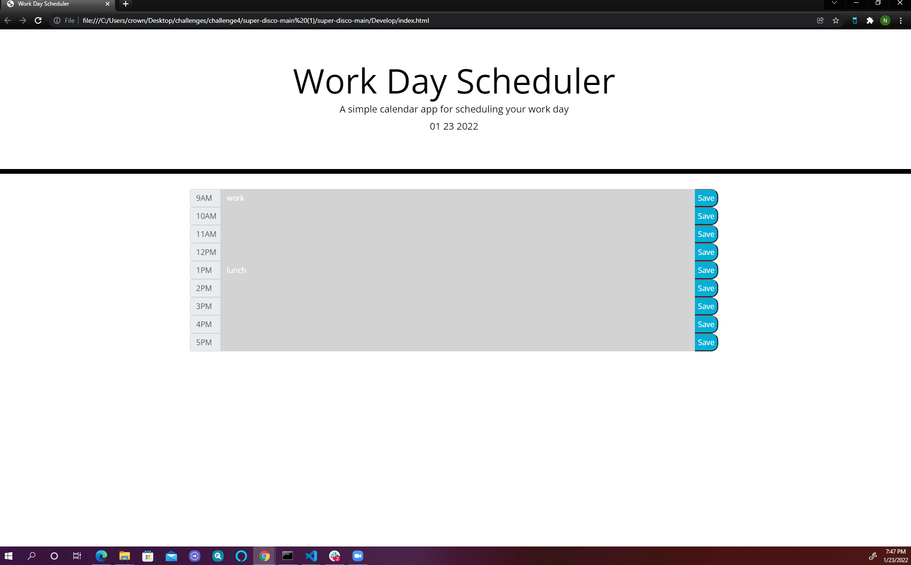

# Work Day Scheduler

This website allows the user to access a daily planner to create a workday schedule.
It presents hour increment time blocks that can store information using local storage.
Time slots are color coded to label times as being in the past, present, or future.

# Links
    - Github: https://github.com/noellecrow/workdayscheduler
    - Deployed:  https://noellecrow.github.io/workdayscheduler/

# Screenshot

